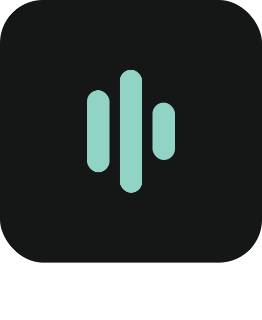
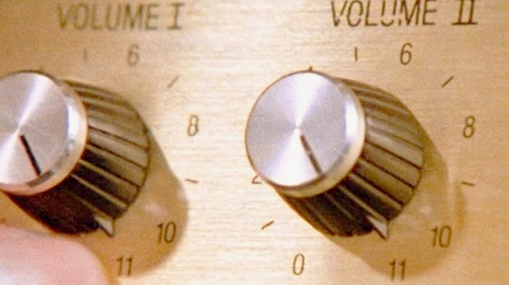
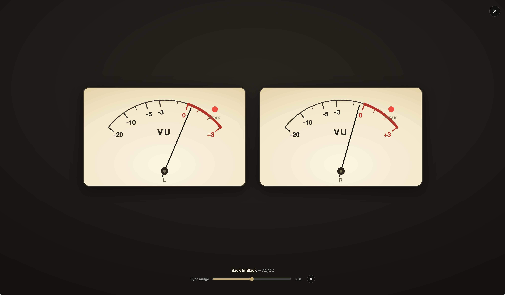

#  MiSonos UX11

Modern TypeScript Sonos controller targeting fast LAN control.

<p align="center">
  
  &nbsp;&nbsp;&nbsp;&nbsp;
  
  &nbsp;&nbsp;&nbsp;&nbsp;
  
</p>

<p align="center"><em>"If we need that extra push over the cliff, you know what we do?"</em></p>

## Screenshots

<!-- Drop PNGs into docs/screenshots/ with these names (see docs/screenshots/README.md). -->

| | | |
| :---: | :---: | :---: |
| <br>**Now playing** | <br>**Zones** | <br>**Browse music** |
| <br>**Zone editor** | <br>**EQ editor** | <br>**Settings** |

## VU meter

<p align="center"></p>

Tap the gauge badge on the album art for a full-screen, vintage-hi-fi **VU meter**.
It's pure SVG, so it scales crisply to any display — it looks especially good on an
iPad propped on a stand while a queue plays in the background. The needles follow
the **real** signal (not a canned animation), with authentic ballistics: RMS
response, the lazy ~300 ms needle, the −20…+3 dB scale with a red zone past 0 VU,
and peak LEDs.

Sonos exposes no output level, so MiSonos measures the audio itself — without ever
downloading a second copy of the stream:

- **This device** — when playing locally, it taps the already-decoded audio with
  the Web Audio API, so the needles are perfectly in sync with what you hear.
- **Sonos** — the bridge tees the exact bytes it's already proxying to the speaker
  into `ffmpeg`, computes per-channel levels, and streams them to the meter over
  SSE; the client lines them up to the playback position (with a sync-nudge trim).

It only works for audio MiSonos itself plays (the bundled sources). Content Sonos
plays natively (Spotify, AirPlay, line-in) isn't visible to us, so the meter shows
"No signal".

## Architecture

- `apps/web`: React + Vite controller UI.
- `apps/bridge`: local Node TypeScript LAN bridge for SSDP discovery and Sonos SOAP calls.
- `packages/sonos-protocol`: shared Sonos models plus SOAP/DIDL/XML helpers.

### SMAPI source servers

MiSonos bundles its own Sonos Music API (SMAPI) servers under `apps/`, each
exposing a music source to your speakers:

- `apps/grateful-smapi`: Grateful Dead recordings from archive.org. Data comes
  from [`grateful-dead-db`](https://github.com/agtilden/grateful-dead-db). (port 4319)
- `apps/phish-smapi`: Phish shows via [Phish.in](https://phish.in). (port 4320)
- `apps/ytmusic-smapi`: YouTube Music. (port 4321)
- `apps/lma-smapi`: the [Live Music Archive](https://archive.org/details/etree). (port 4322)
- `apps/podcast-smapi`: podcasts (Apple Podcasts directory + Podcast Index). (port 4323)
- `apps/tunein-smapi`: internet radio via the [TuneIn](https://tunein.com/radio/home/) directory. (port 4324)

The web app talks to the bridge through a typed HTTP/SSE API. That boundary keeps the UI decoupled from the transport, so a native LAN transport could replace the local Node bridge without changing the web app.

## Installation

MiSonos runs the whole stack (bridge + SMAPI sources + web PWA) on a host on your LAN. See **[DEPLOY.md](DEPLOY.md)** for the full setup — either Docker on a Linux host or native Node on any host (including macOS).

To install the app to your phone's home screen, you need HTTPS (the PWA service worker won't install over plain `http://`). The simplest way is [Tailscale](https://tailscale.com): on the host, run `tailscale serve --bg <web-port>` (`6173` for Docker, `4173` for native), then open `https://<host>.<tailnet>.ts.net` on your phone and use "Add to Home Screen". See [DEPLOY.md](DEPLOY.md) for details.

## Local Development

```sh
npm install
npm run dev
```

The bridge listens on port `4317` and the web app defaults to `http://127.0.0.1:6173`.
For Sonos event subscriptions, the bridge binds to `0.0.0.0` by default so speakers can reach its callback endpoint.

If multicast discovery is unavailable, set known speakers manually:

```sh
MISONOS_SPEAKER_IPS=192.168.1.101,192.168.1.102 npm run dev:bridge
```

If event subscriptions fail because the bridge chooses the wrong local network interface, set the callback address explicitly:

```sh
MISONOS_CALLBACK_HOST=$(ipconfig getifaddr en0) npm run dev:bridge
```

## Checks

```sh
npm run typecheck
npm run test
npm run build
```

## License

MiSonos is source-available under the [PolyForm Noncommercial License 1.0.0](LICENSE.md):
free to use, modify, and share for any **noncommercial** purpose. See [LICENSE.md](LICENSE.md)
for the full terms and [NOTICE](NOTICE) for attributions and trademark disclaimers.

MiSonos is an independent, fan-made project and is not affiliated with or endorsed by
Sonos, Google/YouTube, Apple, the Internet Archive, TuneIn, or any artist or service
it interoperates with.
